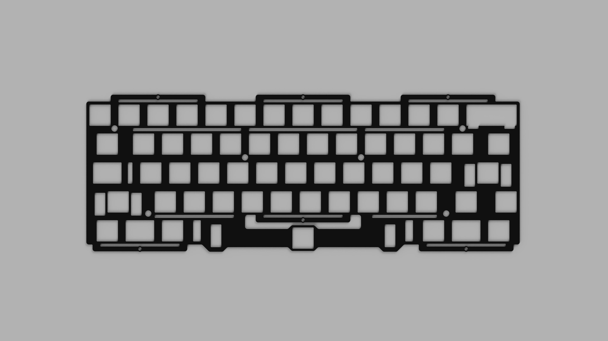
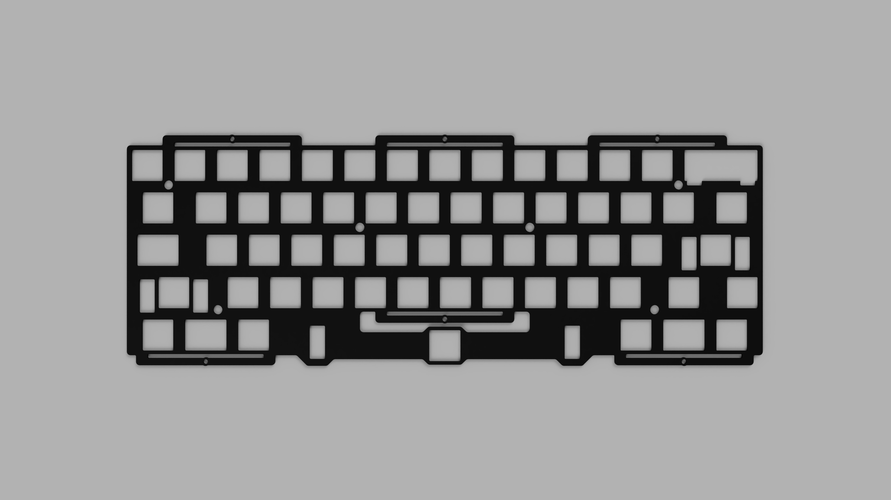
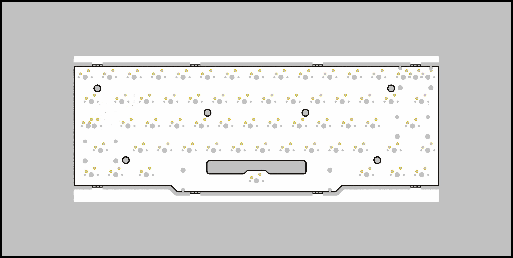
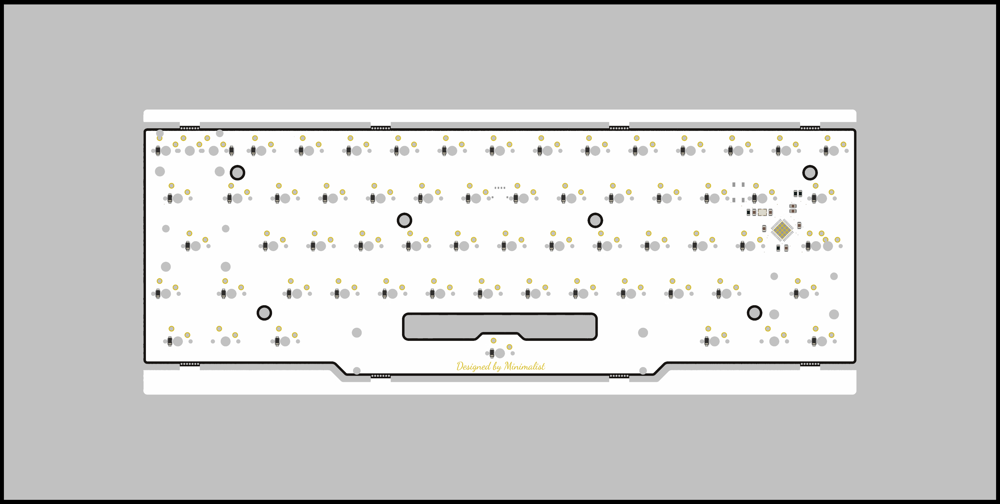
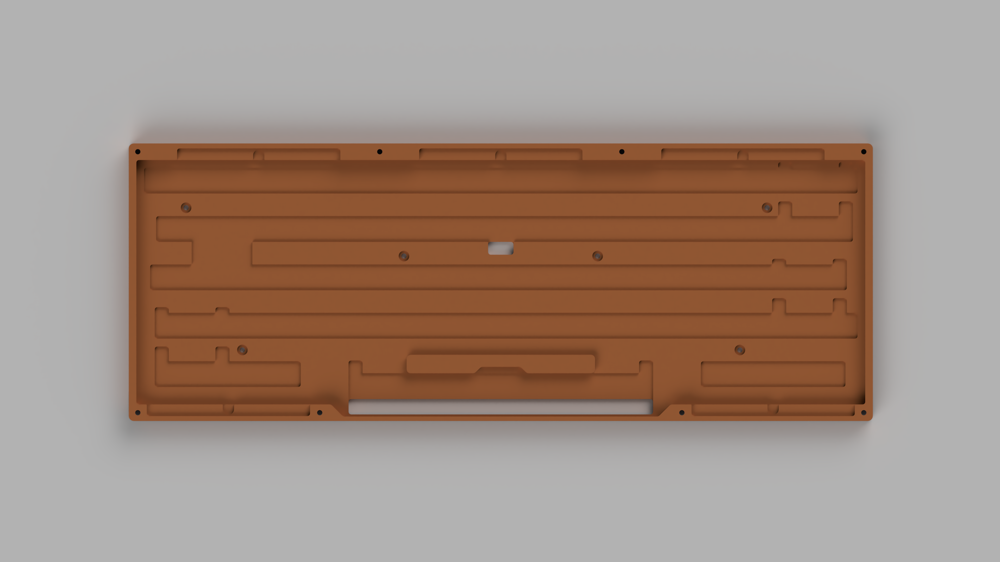
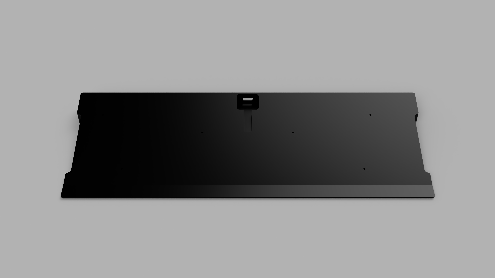
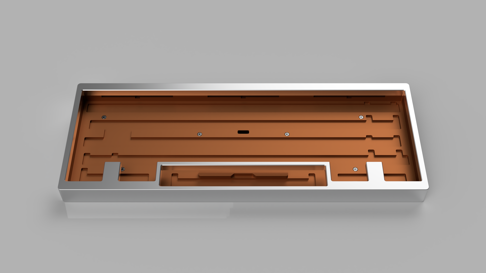
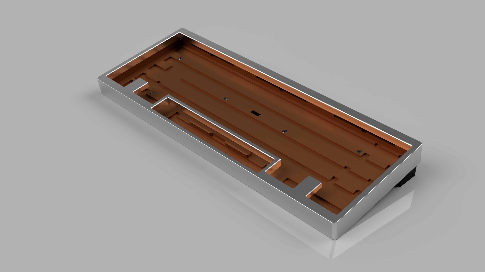
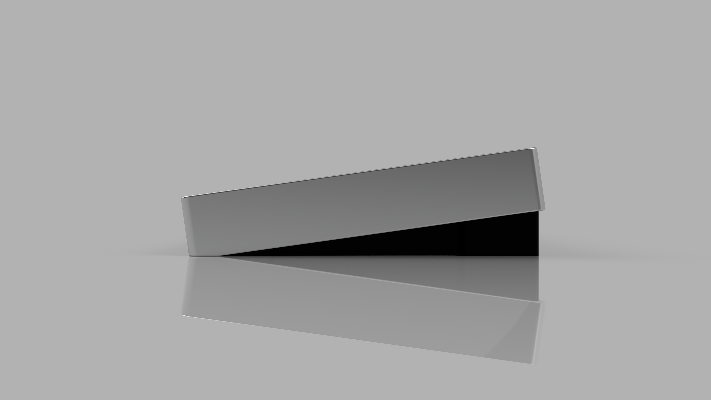
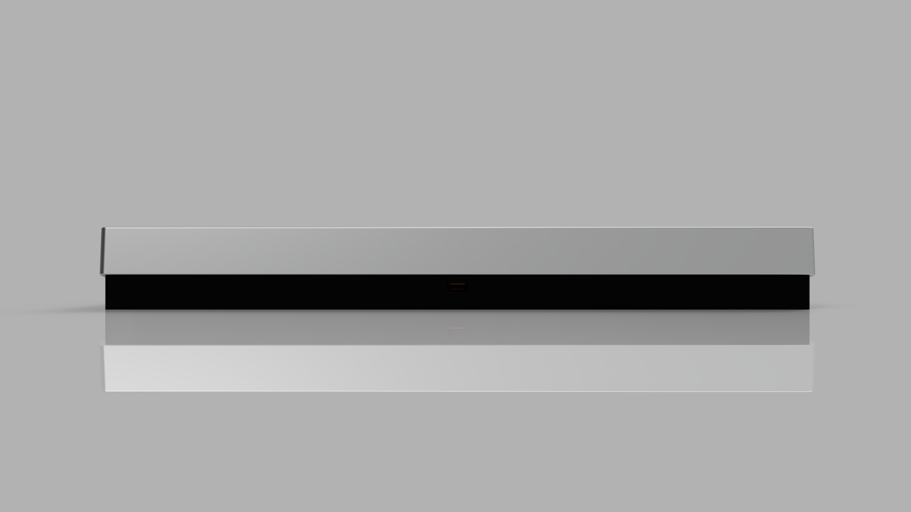

### Minimal60

These are just some rendered pictures.

#### Plate with and without flex cut:

#### PCB:

#### Case:

### Note
There is no qmk/via firmware available since I'm stilling learning XD

I would apreciate it very much if anyone writes one and make a pull request!