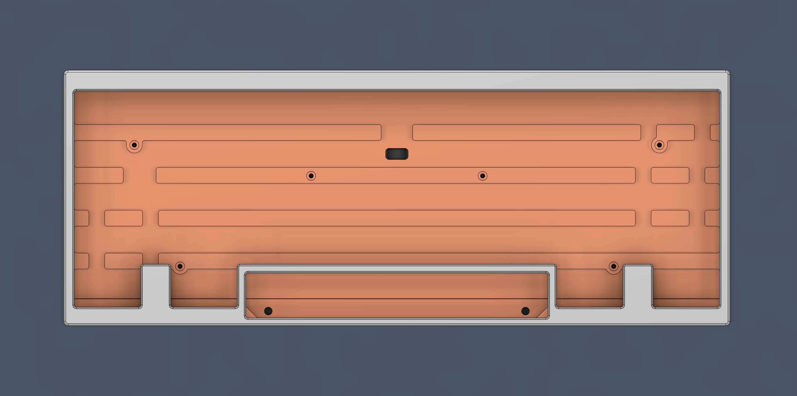
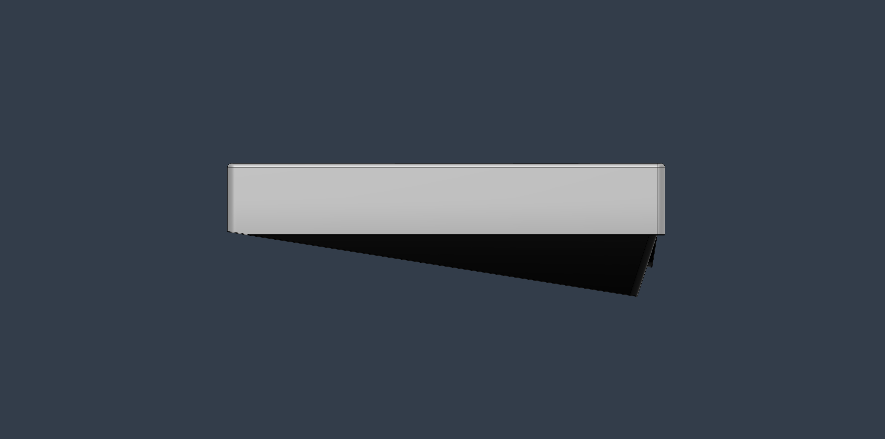
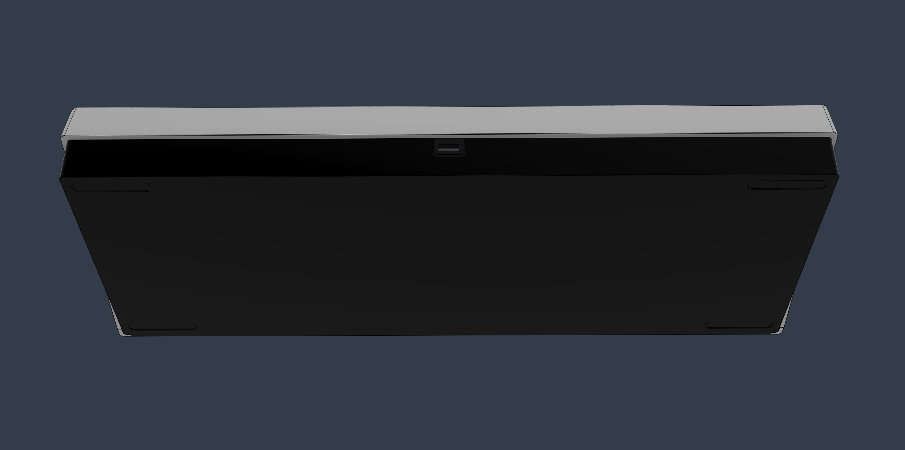
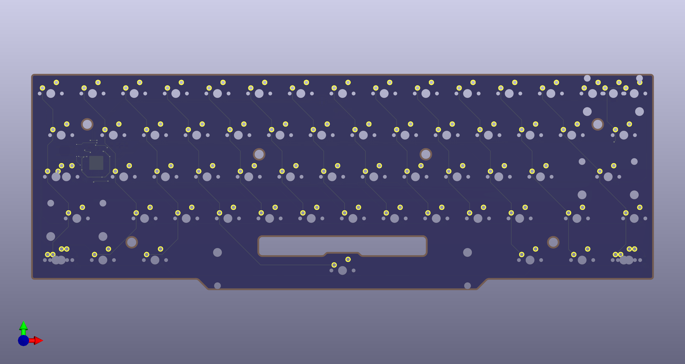
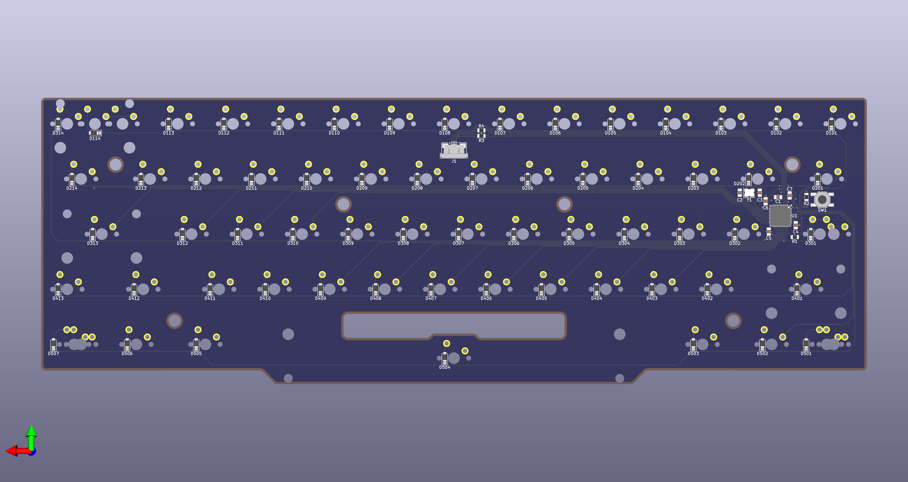

# Minimal60: A 60% customized keyboard with separated spacebar

This keyboard is inspired by Neson Design Keyboards, and GMK keycaps "Minimal".

## Case

The original [step file](./case/Minimal60.step) comes with no decoration. Please, feel free to make your own modification. You may find some useful [resources](./resources/) here.

## PCB 

The PCB uses Atmega32u4 and FPC connector. You can find the UDB with FPC connector in my another repository: [UDB-C-FPC](https://github.com/dianmo42/UDB-C-FPC).

## Firmware

Unfortunately, I haven't got time to learn to write the QMK firmware : (

Please let me know if you could offer some help : )

## Attention!

The feasibility of this project is not guaranteed. Please conduct sample testing before proceeding to formal production.